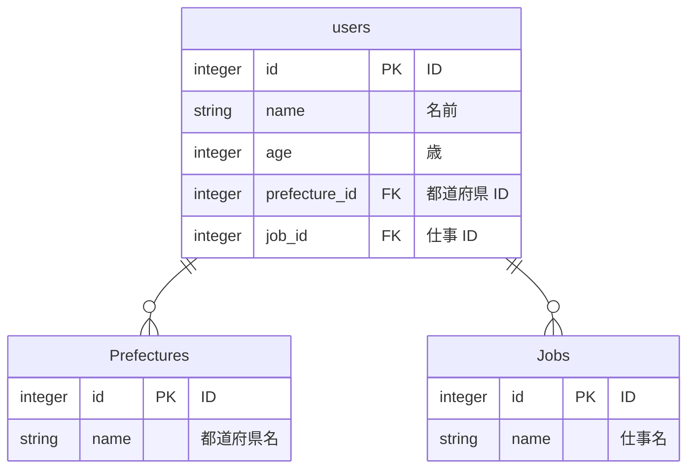
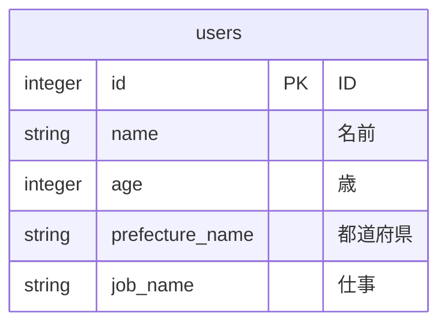

達人に学ぶDB設計 徹底指南書を読んで学びになったことは主に、パフォーマンスに関する知識だ。
以下にまとめていく。

## 前提
データの整合性とパフォーマンスの間には強いトレードオフが存在し、データの整合性を高くしようとすると、パフォーマンスが犠牲になる。データベース設計とは、**限られた予算制約の中で、整合性とパフォーマンスの間の平衡点を見つけ出そうとする努力**だとこの本の中で述べられている。

DBのパフォーマンスを上げるための方法を論理設計、物理設計で分けながら述べていく。(物理設計は別の記事で紹介)

## DBのパフォーマンスが関係する要素
- 論理設計
    - 非正規化
    - サマリデータの冗長性
    - 選択条件の冗長性
- 物理設計
    - インデックス
    - 統計情報

## 論理設計

第５章では正規化の欠点であるSQLのパフォーマンス問題とその対応策が記されている。

そもそも正規化とはデータベースが保持するデータの冗長性を排除し、一貫性と効率性を保持するための設計手法である。同じ内容を表す情報が複数箇所で保存されると、更新処理が複数箇所で必要になったり、更新処理のタイムラグによりデータの不整合が発生してしまう恐れがある。そのようなことを避けるために、正規化が有効なものになる。

SQLのパフォーマンスが下がる原因は主に結合を用いることにある。正規化によって冗長性が排除されたテーブルからデータを参照するためには、結合を用いることが必要になる。しかし、結合によって検索パフォーマンスなどは低下することが多い。
基本的に正規化をするべきだが、非正規化によってパフォーマンスが向上することもあると筆者は主張し、冗長性とパフォーマンスのトレードオフを様々な観点から紹介し、読者に選択肢の提示をしてくれている。

### 検索SQL
厳格な正規化は検索用のSQL文のパフォーマンスとトレードオフの関係にある。その理由はテーブルの結合にある。
正規化によって分割されたテーブルの情報を参照する場合に、結合(join)を用いるが、結合するテーブルの数、レコードの数が多くなればなるほど、処理速度は遅くなる。

**具体例**

あるアプリケーションで ユーザー情報を扱っているとする。ユーザーの情報は名前,年齢, 居住都道府県、 職種 があり、居住都道府県 と 職種は別テーブルに分けられている。


**Users**
|  id |  name  | age |  prefecture_id |job_id  |
| ---- | ---- | --- | ---| ---| 
|  1  |  鈴木  | 24  |  1 |  1|   
|  2  |  関口  |  34 |  2 | 3 | 


**Prefectures**
|  id |  name  | 
| ---- | ---- | 
|  1  |  東京  |
|  2  |  北海道  |
|  3  |  群馬  |


**Jobs**
|  id |  name  | 
| ---- | ---- | 
|  1  |  エンジニア  |
|  2  |  マーケティング |
|  3  |  営業 |


東京でエンジニアをしているユーザーを取り出したい場合に結合が必要になる。


```sql
select * from Users
inner join on Users.job_id = Jobs.id 
inner join on Users.prefecture_id = Prefectures.id
where Users.prefecture_id = 1 (東京)
and where Users.job_id = 1 (エンジニア)
```

上記の例とは逆に、正規化をしないテーブル構造にした場合、結合が必要ないため、同じデータを取り出したいSQLもシンプルなものになり、結合を利用しないためパフォーマンスが向上します。



**Users**
|  id |  name  | age |  prefecture_name |job_name  |
| ---- | ---- | --- | ---| ---| 
|  1  |  鈴木  | 24  |  東京 |  エンジニア|   
|  2  |  関口  |  34 |  北海道 | 営業 | 


```sql
select * from ユーザー
where prefecture_name = "東京"
and where job_name = "エンジニア"
```

### 更新用SQL
逆に更新用のSQL文は正規化されたテーブルの方がパフォーマンスが高い。
正規化によって1つのデータを更新したい場合、必ず更新対象のレコードが１つになるためである。

**具体例**

Job のname を 「エンジニア」 ではなく、 「Software Engineer」という文字列に変更したい場合、
ユーザーテーブルの エンジニアを全て更新する必要があるが、正規化をしていれば Jobs テーブルの1カラムだけを変更すれば済むためである。

```sql

update Jobs set name = 'Software Engineer'　where name = 'エンジニア'

```

### サマリデータを持つ場合の冗長性
テーブルのデータを算出すれば参照できるデータ(サマリデータ)をカラムとして持つことは、冗長性が増すが、検索時のパフォーマンスは高まる。

例えば、ECサイトである商品の月ごとの売上を参照したい場合、購入日を起点に算出して参照することもできるが、1ヶ月ごとの売上数を保存するカラムを作成し、そこから参照する方法もある。
結合を用いて個々のカラムを算出すれば参照できる情報を、別カラムとして保存することは冗長性が増すが、検索するためのパフォーマンスは上がる。

### 非正規化のリスク
非正規化をすることでパフォーマンスは向上するが、もちろんリスクも存在する。前述の通り冗長性が増すこと意外にも主に3点ある。

- 更新のパフォーマンスが低下する
  - サマリデータを格納するカラムを追加した場合、データが増減するたびにサマリデータを更新する処理を追加する必要があること
- データのリアルタイム性
  - サマリデータを更新する処理をデータが追加された瞬間ではなく、ある程度時間を空けて実行する場合(注文が確定するまで時間がかかる場合など)、どのタイミングで更新処理を実行するかによってデータのリアルタイム性が下がることがある。更新対象のデータにどの程度最新性が求められるかによって実行タイミングが変化する
- データ構造を変えることは大変
  - 正規化 => 非正規化 も 非正規化 => 正規化　でもデーターベースの構造を変えることは改修コストがとても大きい。
  - そのため論理設計を実施するときは「システムの品質は今ここで決める」という気概を持つことが大切
  - 論理設計を行う人は開発チームのエースでなければならない

### 論理設計とパフォーマンスでのまとめ

著者自身の正規化/非正規化のスタンスとして**原則として非正規化は許さない**としていた。
非正規化は**あくまで最後の手段**として、利用することが好ましいとしている。